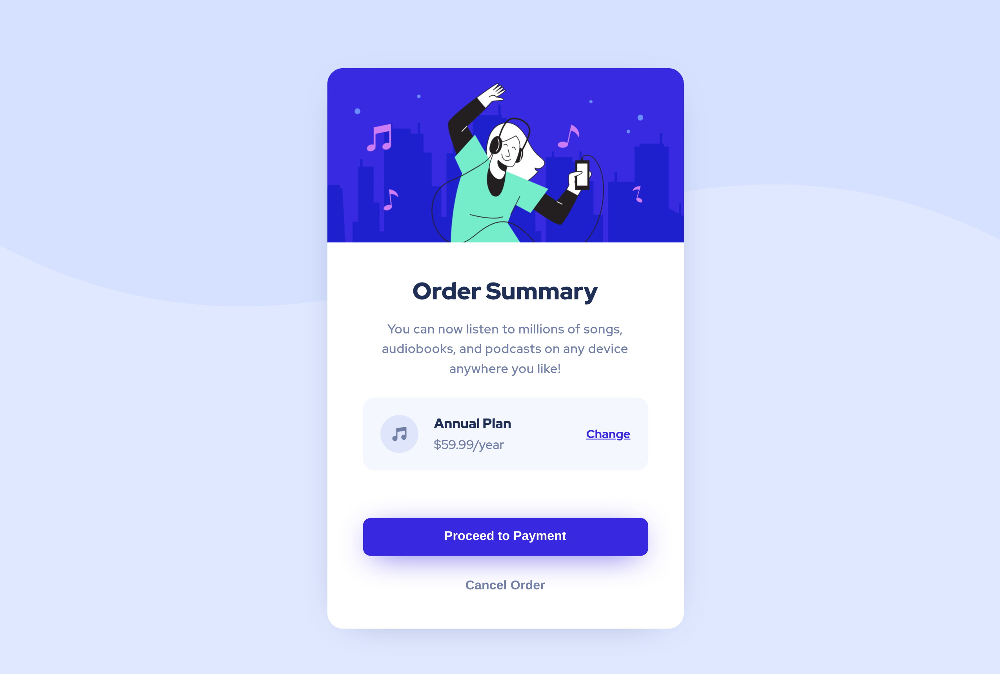

# Frontend Mentor - Order summary card

## Welcome! 👋

Thanks for checking out this front-end coding challenge.

## The challenge

The challenge is to build out an order summary card component and get it looking as close to the design as possible.

Users should be able to:

- See hover states for interactive elements

### Screenshot

## Links

Live demo [Order Summary](https://luis291099.github.io/order-summary-challenge/).

### Built with

- Semantic HTML5 markup
- SASS
- Flexbox
- Mobile-first workflow

## Author

- Frontend Mentor - [@luis291099](https://www.frontendmentor.io/profile/luis291099)